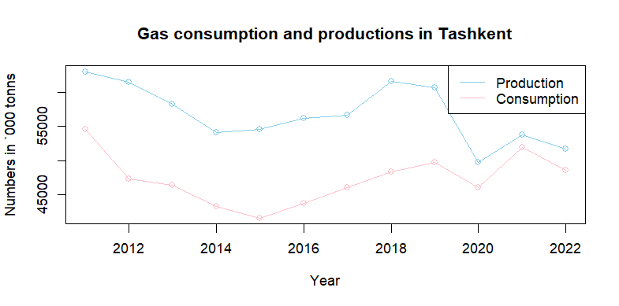

# Анализ данных о Ташкенте

Этот проект представляет собой небольшой анализ данных на основе реальных данных о Ташкенте. Включены следующие аспекты:

- Изучение уровня загрязнения воздуха
- Оценка численности населения
- Анализ потребления угля и газа
- Сравнение потребления угля и газа между собой
- Построение графиков и проведение статистических анализов в R

## Изображения анализов

Ниже представлены изображения, отражающие результаты анализа данных:

- 
- 
- 
- 
- 

## Анализ в R

В ходе анализа данных были использованы статистические методы, включая ANOVA и Multi Linear Regression Modelling в языке R.

## Автор

Проект выполнен и анализ проведен Бобомуродом.
